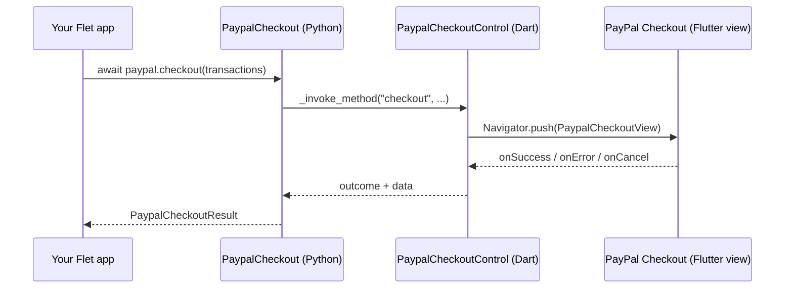

<div align="center">

<!--
  Replace with a real banner/logo once you have one, e.g.:
  
-->

# flet-paypal-payment

[](https://git.io/typing-svg)

**PayPal's hosted checkout, wrapped as a single Flet control.**
Built on top of [`flutter_paypal_payment`](https://pub.dev/packages/flutter_paypal_payment).

[](https://pypi.org/project/flet-paypal-payment/)
[](https://flet.dev)
[](LICENSE)
[](https://developer.paypal.com/dashboard/applications/sandbox)

[](#-requirements)
[](#-requirements)
[](#-requirements)
[](#-requirements)
[](#-requirements)
[](#-requirements)

[Install](#-install) · [Usage](#-usage) · [API](#-api) · [How it works](#-how-it-works) · [Example](#-example-app) · [Contributing](#-contributing)

</div>

---

## ✨ Features

- 🛒 **One method, one result** — `await paypal.checkout(...)` opens PayPal's hosted checkout and resolves to a typed `PaypalCheckoutResult` (`SUCCESS` / `ERROR` / `CANCELLED`).
- 🧾 **Typed transactions** — build carts with `PaypalTransaction` / `PaypalItem` / `PaypalShippingAddress` instead of hand-rolled dicts.
- 🔔 **Events, if you want them** — `on_success`, `on_error`, `on_cancel` fire alongside the awaited result, for event-driven code.
- 🧪 **Sandbox-first** — `sandbox_mode=True` by default, so you're testing against PayPal's sandbox until you flip one flag.
- 📱 **Android & iOS, tested** — built on Flet/Flutter so it should run anywhere Flet does, but only Android and iOS have actually been verified so far (see [Requirements](#-requirements)).

## 📦 Install

```bash
pip install flet-paypal-payment
```

Or add it to `pyproject.toml`:

```toml
dependencies = [
    "flet-paypal-payment",
]
```

<details>
<summary><b>Other dependency styles</b> (local path, git)</summary>

<br />

**Local path** (for developing against a cloned copy):

```toml
dependencies = [
    "flet-paypal-payment @ file:///absolute/path/to/flet-paypal-payment",
]
```

> ⚠️ The path must be **absolute** and point at this package's root (the
> folder containing *its* `pyproject.toml`). This is also the form
> `flet build <target>` expects — `[tool.uv.sources]` path overrides are
> only honored by `uv run`/`uv sync`, not by Flet's own build resolver.

**Git:**

```toml
dependencies = [
    "flet-paypal-payment @ git+https://github.com/<you>/flet-paypal-payment.git",
]
```

</details>

## 🚀 Usage

```python
import flet as ft
import flet_paypal_payment as ftp


@ft.component
def App(paypal: ftp.PaypalCheckout):
    result, set_result = ft.use_state(None)

    async def buy(e: ft.Event[ft.Button]):
        set_result(
            await paypal.checkout(
                transactions=[
                    ftp.PaypalTransaction(
                        total="19.99",
                        currency="USD",
                        description="A really nice Flet t-shirt",
                        items=[
                            ftp.PaypalItem(name="Flet T-Shirt", quantity=1, price="19.99"),
                        ],
                    ),
                ],
            )
        )

    status = "" if result is None else result.outcome.value
    return ft.Column([
        ft.Button(content="Buy for $19.99", on_click=buy),
        ft.Text(status),
    ])


def main(page: ft.Page):
    # PaypalCheckout renders nothing itself — it just needs to be mounted
    # somewhere in the control tree. page.overlay is the usual place.
    paypal = ftp.PaypalCheckout(
        client_id="YOUR_SANDBOX_CLIENT_ID",
        secret_key="YOUR_SANDBOX_SECRET_KEY",
        sandbox_mode=True,  # False for live payments
    )
    page.overlay.append(paypal)
    page.render(App, paypal)


ft.run(main)
```

## 📖 API

### `PaypalCheckout` control

| Member | Description |
|---|---|
| `client_id: str` | PayPal REST API Client ID (sandbox or live). |
| `secret_key: str` | PayPal REST API Secret. |
| `sandbox_mode: bool` | Use PayPal's sandbox environment. Defaults to `True`. |
| `note: str \| None` | Default note shown to the buyer. |
| `on_success` / `on_error` / `on_cancel` | Fired in addition to (not instead of) `checkout()`'s return value. |
| `async checkout(transactions, note=None, timeout=300) -> PaypalCheckoutResult` | Opens the checkout screen and awaits the result. |

### Types

| Type | Fields |
|---|---|
| `PaypalTransaction` | `total, description="", currency="USD", subtotal=None, shipping="0", shipping_discount=0, items=[], shipping_address=None` |
| `PaypalItem` | `name, quantity, price, currency="USD"` |
| `PaypalShippingAddress` | `recipient_name, line1, line2, city, country_code, postal_code, phone, state` |
| `PaypalCheckoutResult` | `outcome, data=None, error=None` |
| `PaypalCheckoutOutcome` | `SUCCESS`, `ERROR`, `CANCELLED` |

## 🧠 How it works

`PaypalCheckoutView` (from `flutter_paypal_payment`) is designed to be
pushed as a **full-screen route**, not embedded inline. So on the Dart
side, `PaypalCheckout` is a `DialogControl`-style control: it renders
nothing (`SizedBox.shrink()`), but once mounted it uses its own
`BuildContext` to call `Navigator.push(...)` when `checkout()` is invoked
from Python. That's why the control still needs to be added to the tree
(e.g. `page.overlay`) even though it has zero size.



## 🧪 Example app

A full runnable app lives in [`examples/paypal_payment_example`](examples/paypal_payment_example).

1. Edit `examples/paypal_payment_example/pyproject.toml` and point the
   `flet-paypal-payment` dependency at this repo's **absolute** local path
   (this is also the form `flet build` requires — see the
   [install notes](#-install)):

   ```toml
   dependencies = [
       "flet-paypal-payment @ file:///home/pc-name/flet-paypal-payment",
       "flet",
   ]
   ```

   Replace `/home/pc-name/flet-paypal-payment` with wherever you actually
   cloned/unzipped this repo (run `pwd` in the repo root to get it).

2. Run it:

   ```bash
   cd examples/paypal_payment_example
   uv sync
   uv run src/example_1.py
   ```

> ⚠️ **Testing status:** this extension has only been verified on
> **Android and iOS**. Building for other targets has only been exercised
> with `flet build` on **Ubuntu**  —  building from Windows/macOS, or
> targeting macOS/Windows/Linux/Web, hasn't been tested yet. If you try
> one of those combinations, a PR or issue reporting the result is very
> welcome.

## ✅ Requirements

| | |
|---|---|
| **Flet** | ≥ 0.86.4 |
| **PayPal account** | A REST API app (sandbox or live) from the [PayPal Developer Dashboard](https://developer.paypal.com/dashboard/applications/sandbox) |
| **Platforms — tested** | Android, iOS |
| **Platforms — untested** | macOS, Windows, Linux, Web (should work, since it's plain Flet/Flutter, but not yet verified) |
| **Build environment — tested** | Ubuntu (`flet build apk` / `flet build ipa`) |

## 🤝 Contributing

Issues and PRs are welcome. If you're extending the control (e.g. wrapping
more of `flutter_paypal_payment`'s surface), keep the Python side
snake_case and typed, and keep Dart's returned map keys matching the
Python dataclass fields exactly.

## 📄 License

[Apache-2.0](LICENSE)

---

<div align="center">
<sub>Not affiliated with or endorsed by PayPal, Inc.</sub>
</div>
